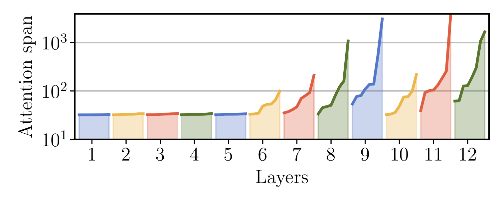

# Sequential Transformer
This is a code for training Transformers on language modeling tasks. To better adapt to sequential tasks, it uses caching of previous representations and relative position embeddings. The code also implements the following projects as described below:
- [Adaptive Attention Span](#adaptive-attention-span)
- [All-attention Network](#all-attention-network)

## Requirements
You need PyTorch 0.4.1 or above and a cuda-enabled GPU to run the code.


## Adaptive Attention Span
This code can be used for running experiments in [Adaptive Attention Span for Transformers](https://arxiv.org/abs/1905.07799) paper. The adaptive span allows a model to learn an optimal context size for each self-attention head from training data. As shown in the below figure, only few heads require long attention span, thus making it possible to increase the context size to 8k tokens without increasing computation time and memory footprint significantly.

<div align="center">
  
</div>

### Running experiments in the paper
Scripts for running experiments in the paper are located in `./experiments/` directory. For example, a smaller 8-layer version of our model can be trained on a single GPU by running:
```bash
bash experiments/enwik8_small.sh
```
It should reach about 1.3bpc on dev after 150k steps.

For training larger models, multiple GPUs are recommended. In the script files, you can configure the number of available GPUs. Increase the `--batch-split` argument if you run out of GPU memory (it splits batches into smaller pieces without changing the final result).

We  obtained the following results in our experiments:

| Experiment | #params | dev (bpc) | test (bpc,bpb) |
| ---------- | ---:| ---:| ----:|
| enwik8 | 38M | 1.04 | 1.02 |
| enwik8_large | 209M | 1.00 | 0.98 |
| text8 | 39M | 1.05 | 1.11 |
| text8_large | 209M | 1.01 | 1.07 |

### Pre-trained models
You can download pre-trained models by running the `get_pretrained.sh` script. Then the same scripts in `./experiments/` can be used to evaluate those models. Since the download script puts models in `./checkpoints/`, make sure there is no file with the same name. Note that these pre-trained models are obtained by rerunning the training scripts after the code cleanup, so there are small differences from the above results due to the randomness of the training.

### More about the code
- **Multi GPUs and nodes:** By default, the code uses `nn.DataParallel` to utilize all available GPUs. For more efficiency, enable distributed training by `--distributed` argument, which can run on multiple nodes.
- **Base model:** As a base model, the code implements a Transformer model with relative position embeddings and hidden state caching for processing a sequence of tokens.
- **Adaptive attention span:** An argument `--adapt-span` enables adaptive span. Otherwise a model will have a fixed attention span. The adaptive-span is implemented as a `nn.Module` to make it easier to plug it into other models.
- **Training time:** A large model training takes about 1.2sec/batch near the end (initially it's faster because the attention spans are smaller) on 8 V100 GPUs. So, for example, the whole `enwik8_large` training of 170k steps should take less than 2.4 days.

## All-attention Network
The code also can be used for training All-attention Networks introduced in [Augmenting Self-attention with Persistent Memory](https://arxiv.org/abs/1907.01470). If `--pers-mem-size` argument is set to `N`, all FF sublayers will be removed from the model and `N` persistent memory vectors will be added to every self-attention sublayer. The following experiments can be found in `./experiments/` directory.

| Experiment | #params | dev | test |
| ---------- | ---:| ---:| ----:|
| enwik8_pers_small.sh | 39M |  |  |
| enwik8_pers.sh | 114M | 1.00 bpb | 0.98 bpb |
| wiki103_pers.sh | 133M | 18.8 ppl *| 19.7 ppl *|
(\*This number is slightly better than the paper because it includes end-of-line as a token.)

## License
The code is licensed under CC-BY-NC license. See the LICENSE file for more details.

## Acknowledgement
We thank Xavier Martinet for helping with cleaning the code. The data preprocessing scripts are downloaded from [awd-lstm](https://github.com/salesforce/awd-lstm-lm/) and [transformer-XL](https://github.com/kimiyoung/transformer-xl) repos. The `adagrad_with_grad_clip.py` is mostly adapted from PyTorch.
